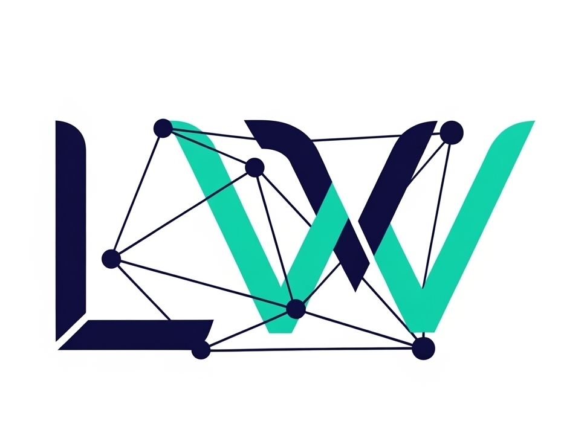

# 📋 ImmutableU: AI-Powered Legal Contract Management Platform on Cardano Blockchain

# 🚀 Welcome to ImmutableU

**The World's First AI-Powered Legal Contract Platform Built on Cardano**
Streamline your legal workflow with blockchain security, AI assistance, and multi-signature capabilities

## Demo Video

<a href="https://youtu.be/bvhC9JpJ8U8"> Video Link </a>
🎥 [Watch the Introduction Video](https://youtu.be/bvhC9JpJ8U8)

> _"Revolutionizing legal contracts through decentralized trust, intelligent automation, and immutable security. Powered by Cardano. Driven by AI. Designed for the future of law."_

✨ Bridging Legal Expertise with Blockchain Trust & AI Intelligence ✨

---

---

## 🚀 Overview

**ImmutableU** is a groundbreaking platform that redefines how legal contracts are created, signed, and managed. By seamlessly integrating advanced Artificial Intelligence with the immutable and transparent Cardano blockchain, ImmutableU introduces a new era of trust, efficiency, and accessibility to the legal contracting process.

From AI-assisted drafting and smart template utilization to robust multi-signature capabilities, ImmutableU empowers users through the entire contract lifecycle with unmatched transparency and control.

---

## 🏗️ System Architecture

ImmutableU is built using a modular, service-oriented architecture divided into three core systems:

### 🧠 AI Legal & Cardano Blockchain Assistant System

This system acts as the intelligent brain of ImmutableU. It provides:

- Legal insights for Civil, Corporate, and Property Law
- Smart contract generation and AI-driven document review
- Integration with Cardano blockchain data

➡️ [Explore the AI Legal & Cardano Assistant System : Quick Start & Setup Guide](./mcp/README.md)

---

### 💻 Frontend: ImmutableU UI

The user interface is clean, responsive, and intuitive. Features include:

- Wallet connection and digital signature management
- Dynamic contract templates
- AI-assistance embedded in the UI

➡️ [ImmutableU Frontend: Quick Start & Setup Guide](./frontend/README.md)

---

### ⚙️ Backend: Smart Contract Management API

This backend system:

- Manages user authentication & role-based access
- Handles blockchain document verification & digital signatures
- Ensures full contract lifecycle security

➡️ [ImmutableU Backend: Quick Start & Setup Guide](./backend/README.md)

---

## 🙏 Acknowledgments

We extend our deepest gratitude to the following technologies, communities, and resources that were instrumental in bringing **ImmutableU** to life:

- **Cardano Foundation** — For providing the foundational blockchain infrastructure.
- **BlockFrost** — For enabling seamless API access to the Cardano blockchain.
- **Mesh SDK** — For Cardano integration tools.
- **Aiken** — For smart contract development tools.
- **The Incredible Open-Source Community** — For invaluable tools and libraries.

---

> 🏆 **Built for UniHack 2025** — Organized by [CoinCeylon](https://coinceylon.com/)

> ✨ **ImmutableU** was proudly developed for **UniHack 2025**  
> _Sri Lanka's pioneering Inter-University Blockchain Hackathon!_

This platform — a flagship project from **UniHack 2025** — showcases the power of **AI + Cardano Blockchain** for secure, transparent legal contracts.

Organized by **CoinCeylon** and **FCT, University of Kelaniya**, UniHack 2025 empowers the next generation of tech leaders to build impactful blockchain solutions.

> ⚖️ **ImmutableU** stands as a prime example of this innovative spirit.

---

 
Built with passion for a transparent and trusted legal future.

